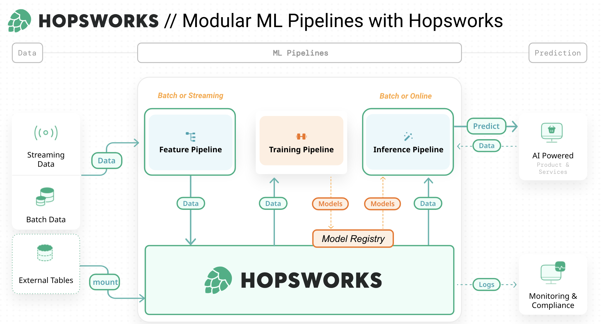
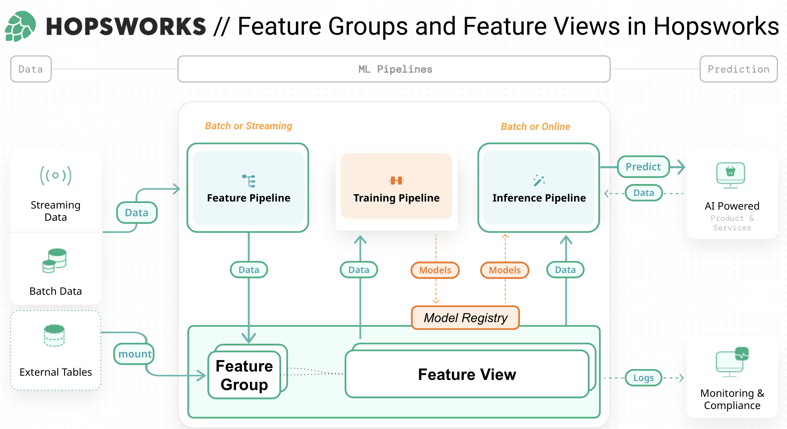
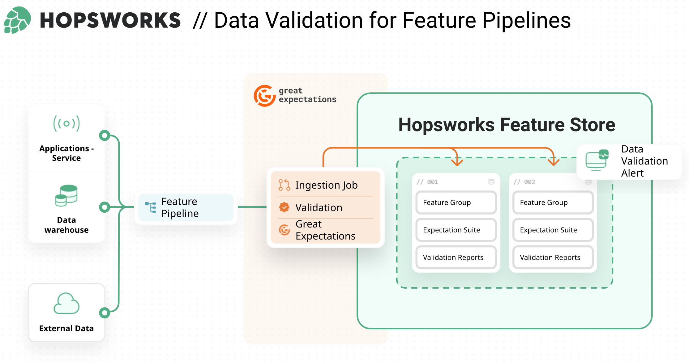
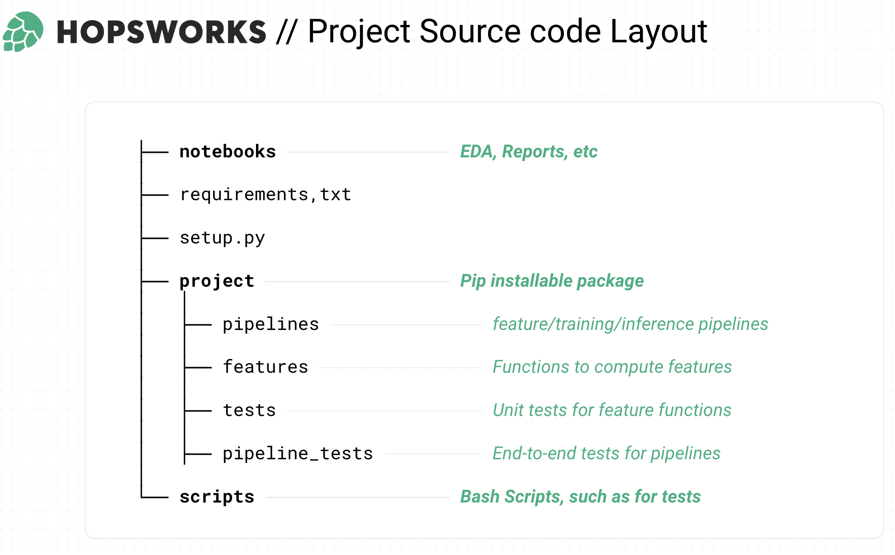

## Hopsworks MLOps Template

## Introduction
In this tutorial we will build a unified architecture that describes both batch ML systems and real-time ML systems and 
define feature pipelines, training pipelines, and inference pipelines that share a common storage layer for the ML 
artifacts they produce and  consume (features, models).  

MLOps is really about continual development of ML-enabled products that evolve over time. The available input 
data (features) changes over time, the target you are trying to predict changes over time. You need to make changes to 
the source code, and you want to ensure that any changes you make do not break your ML system or degrade its performance.
And you want to accelerate the time required to make those changes and test before those changes are automatically 
deployed to production.

## Modular ML Pipelines with Hopsworks

- a feature pipeline that takes as input raw data that it transforms into features (and labels)
- a training pipeline that takes as input features (and labels) and outputs a trained model, and
- an inference pipeline that takes new feature data and a trained model and makes predictions.

## Feature Groups and Feature Views in Hopsworks

Feature Groups (FG) in Hopsworks are defined by a schema (similar to a Pandas DataFrame or a table in a relational 
database). The schema consists of feature names and data types. One can think of these FGs as a destination table where 
feature pipelines regularly insert DataFrames, appending, updating, or deleting rows. A feature group can be seen as a 
collection of conceptually related features that are computed together at the same  cadence. Feature groups provide a 
namespace for features, so two features are allowed to have the same name as long as they belong to different feature 
groups. For instance, in a real-life setting we would likely want to experiment with different window lengths. In that 
case, we can create feature groups with identical schema for each window length.

The Feature View is the collection of features (from feature groups) and transformation functions used to train models 
and serve precomputed features to deployed models. The Feature View includes all of the features defined in the query 
object you created earlier. It can additionally include filters, one or more columns identified as the target(s) 
(or label) and the set of transformation functions and the features they are applied to.

## Data Validation for Feature Pipelines

As the Feature Store simplifies and encourages the reuse of features, it makes sense to validate data before writing to
any Feature Groups. Data validation is performed once per feature rather than once per use-case. Not only does it reduce
the validation burden on the data engineering team but it also builds trust in the quality of the data available in the
Feature Store. Taking advantage of Great Expectations integration eliminates these obstacles. Simply attach your GE
expectation suite to a FG, and Hopsworks python client will take care of the data validation step automatically on
every insert. In addition the Feature Store centralizes everything by storing both the data, the suite and validation
reports.

Hopsworks integrates with Great Expectations to enable validation of data which are about to be inserted into the 
Feature Store. This allows data validation to act both as a gatekeeper for the Feature Store but also to monitor 
and document the incoming data.  Gatekeeping ensures that production projects can maintain high quality data, while 
monitoring enables the team to follow the evolution of the underlying data. The aim should be to create confidence 
for downstream users that the data in the Feature Store have been thoroughly  validated and can be relied on for 
production grade applications, especially for online enable projects.

Great Expectations (GE) enables organizations to ensure high quality feature data . At its core, GE provides
Expectations which can be evaluated against DataFrames. This generates a report that can be used both as data
documentation but also as fulfilled production requirements for data quality.

## Project Source code Layout

